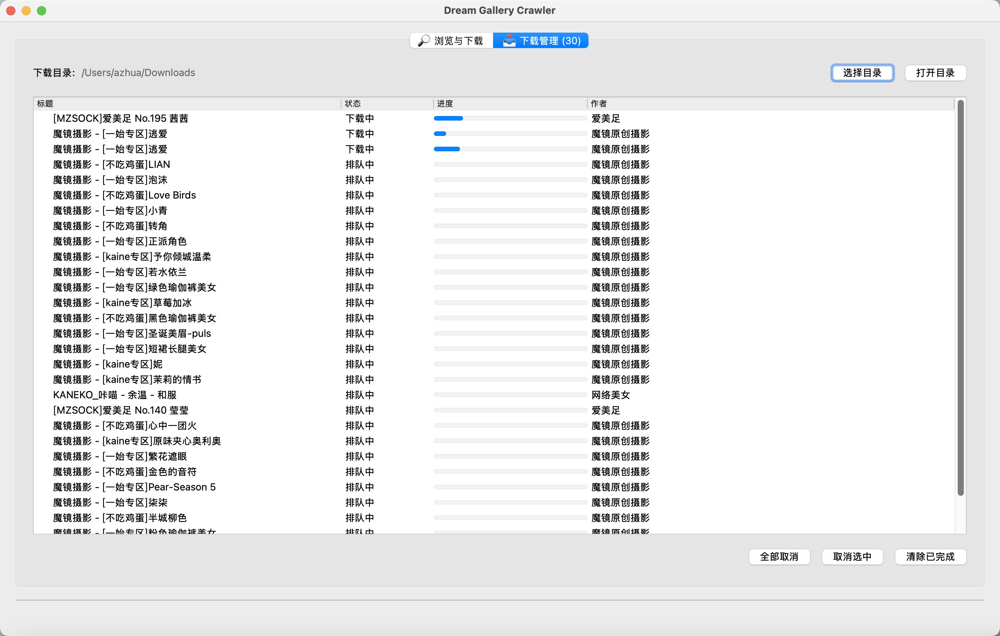

# Photograph
Dream Gallery Crawler designed to provide a powerful and user-friendly solution for scraping and batch downloading images. It helps users efficiently search, preview, and batch download image sets from specified websites through a clean and intuitive graphical interface.




## Features
- **Powerful Search**: Seamlessly search for image galleries using keywords or directly parse URLs for instant access.
- **Intuitive Previews**: Browse search results as thumbnails and preview full galleries before downloading.
- **Flexible Downloading**: Download individual images, entire galleries, or batch download multiple galleries from search results (selected items, current page, or all pages).
- **Comprehensive Download Management**: A dedicated tab to monitor download progress, view status, cancel tasks, and clear completed jobs.
- **User-Friendly Interface**: A clean and intuitive graphical interface for a smooth user experience.

## How to Use
1.  Enter keywords in the top input box and click the "Search" button, or paste a target URL and press Enter.
2.  The program will display the search results as thumbnails.
3.  Click the "Preview" button below a gallery to browse all images as thumbnails, or click "View Original" to see the full-size image.
4.  Click the "Download" button below a gallery, or choose to download from the preview window, to add the task to the "Download Management" list.
5.  After selecting galleries, use the "Download Selected", "Download This Page" buttons to perform batch downloads, or "Download All Results" to download all pages.
6.  Switch to the "Download Management" tab to view, pause, cancel, or clear download tasks.

## Installation
Python 3.10 or higher is recommended.

```bash
pip install -r requirements.txt
```

## How to Run

```bash
python photograph.py
```

## License
This project is licensed under the MIT License - see the [LICENSE](LICENSE) file for details.

## Disclaimer
1.  **Project Purpose and Nature**
    This project (hereinafter referred to as "the Project") is created as a technical research and learning tool, intended for exploring and studying web data scraping techniques, and is provided for technical exchange among learners and researchers.

2.  **Legal Compliance Statement**
    The developer of this Project (hereinafter referred to as "the Developer") solemnly reminds users to strictly comply with local laws and regulations when downloading, installing, and using the Project. Users shall bear all legal responsibilities that may arise from the use of this Project.

3.  **Limitation of Use**
    This Project is strictly prohibited for any illegal purposes or commercial activities not related to learning or research. The Project must not be used for any form of illegal intrusion into others' computer systems, nor for any act that infringes upon the intellectual property or other legitimate rights of others. Users must ensure that their use of the Project is solely for personal learning and technical research and not for any illegal activities.

4.  **Disclaimer of Liability**
    The Developer has made every effort to ensure the legitimacy and security of the Project but shall not be liable for any form of direct or indirect loss that may arise from the user's use of the Project. This includes, but is not limited to, any data loss, equipment damage, legal proceedings, etc., resulting from the use of the Project.

5.  **Intellectual Property Statement**
    The intellectual property rights of this Project belong to the Developer. The Project is protected by copyright laws, international copyright treaties, and other intellectual property laws and treaties. Users may download and use the Project provided they comply with this statement and relevant laws and regulations.

6.  **Final Interpretation**
    The final right of interpretation regarding this Project belongs to the Developer. The Developer reserves the right to change or update this disclaimer at any time without prior notice.

## Acknowledgements
- 吾爱@DrCatcher
