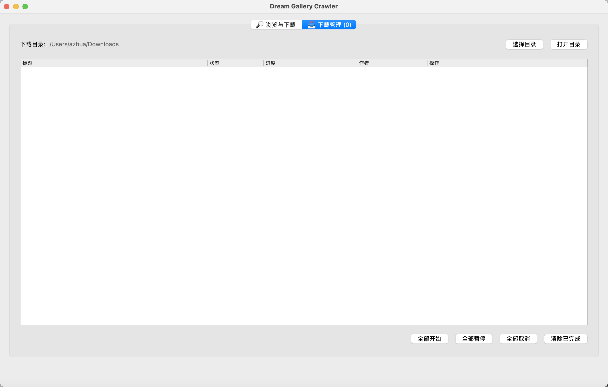

# Photograph
Dream Gallery Crawler designed to provide a powerful and user-friendly solution for scraping and batch downloading images. It helps users efficiently search, preview, and batch download image sets from specified websites through a clean and intuitive graphical interface.




> This project is for learning and research purposes only. It is strictly forbidden for illegal use, otherwise, you will be responsible for the consequences. If there is any infringement, please contact me to delete it.

## Features
- **Keyword Search**: Search for image sets by keywords.
- **URL Parsing**: Supports browsing image sets or lists directly via URL.
- **Pagination**: Supports navigating and jumping between pages of search results.
- **Gallery Preview**: Preview all images in a gallery before downloading.
- **Single Image View**: View or download single original images during preview.
- **Batch Download**: Supports downloading selected, current page, or all pages of image sets.
- **Download Management**: View download task status and progress, with support for canceling tasks and clearing records.

## How to Use
1.  Enter keywords in the top input box and click the "Search" button, or paste a target URL and press Enter.
2.  The program will display the search results as thumbnails.
3.  Click the "Preview" button below a gallery to open a new window and view all its images.
4.  Click the "Download" button below a gallery, or choose to download from the preview window, to add the task to the "Download Management" list.
5.  Use the "Download Selected", "Download This Page" buttons after checking galleries to perform batch downloads.
6.  Switch to the "Download Management" tab to view and manage all download tasks.

## Installation
Python 3.10 or higher is recommended.

```bash
pip install -r requirements.txt
```

## How to Run

```bash
python photograph.py
```

## License
MIT License

## Acknowledgements
- 吾爱@DrCatcher
